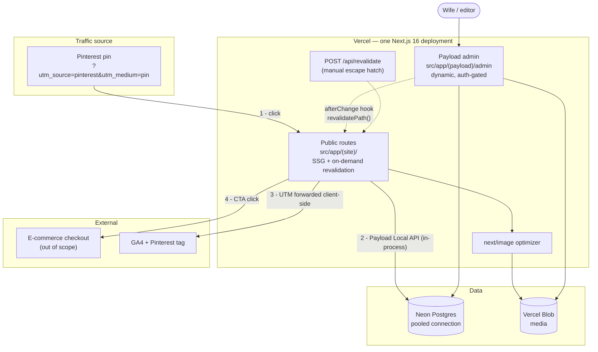
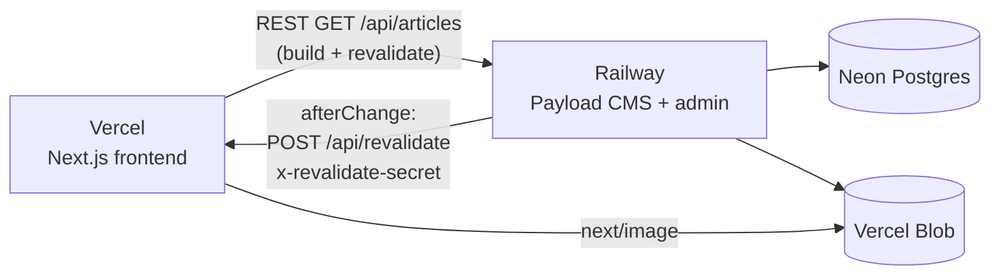

# WellWithHer — Implementation Plan

**Status:** Draft for review · **Owner:** Caique · **Date:** 2026-09-10
**Repo:** `/Users/caiqueroschel/Code/personal/wellwithher` · **Domain:** hercozygrowth.com

> This document is the thing to mark up. Nothing below has been implemented. Once approved,
> implementation runs ticket by ticket (see §11) with Sonnet, one branch/PR per ticket.

---

## 1. Executive summary

We are building a small, SEO-first content site whose only job is to convert Pinterest traffic
into outbound clicks to an external e-commerce checkout. Every article exists to back exactly one
pin and one buy link. There are four routes — `/`, `/[category]`, `/[category]/[pinId]/[slug]`,
`/contact` — and two content types: `Article` and a `SiteInfo` singleton.

**Architecture in one paragraph.** Content lives in Payload CMS (code-first, TypeScript schema,
self-hosted admin) backed by Postgres, with uploaded images served through a Payload storage
adapter. The Next.js App Router frontend renders article and category pages statically at build
time via `generateStaticParams`, reading content through Payload's Local/REST API inside Server
Components. When the wife publishes an edit, a Payload `afterChange` hook triggers revalidation of
the affected article path and its category page, so edits go live immediately without a rebuild.
SEO is handled per-route with `generateMetadata`, `sitemap.ts`, `robots.ts` and `Article` JSON-LD.
UTM parameters are captured client-side and forwarded to analytics only — they never influence
routing or rendering.

### Decisions already locked in

- **Single Next.js app.** No pnpm workspace, no `packages/` split, no second app. The reference
  monorepo's *internal folder discipline* is ported into `src/`; the monorepo shape is not.
- **`app/` lives under `src/`** (`src/app/`), so every first-party file is under `src/`.
- **MUI only. Tailwind is removed.** Tailwind is currently only default scaffolding with nothing
  built on it — safe to delete in Ticket 0.
- **Theme via `createTheme({ cssVariables: true })`**, palette and typography from the design
  reference. `sx` for one-offs; no `styled()` (the reference project has zero usages).
- **TanStack Query, not Redux.** Services stay pure fetchers; no actions/reducers/`RootState`/
  global loading tracker. Colocated `queryKeys.ts` + `queries.ts` per domain. Scope is deliberately
  narrow — see §6.
- **Vitest**, with all tests in a `src/__tests__/` tree mirroring `src/`. Never colocated.
  Storybook stories, if used, *are* colocated — the opposite rule.
- **Conventions ported from the reference project:** arrow-function components, named exports only,
  no default exports, no `forwardRef` (React 19 ref-as-prop), no hardcoded labels in JSX,
  `UPPER_SNAKE_CASE` module-scope constants, baseUrl-rooted imports sorted by `simple-import-sort`,
  `no-nested-ternary: 'error'`, `@typescript-eslint/no-misused-promises`,
  `react-refresh/only-export-components`, TS `recommended` + `stylistic`, prettier config last.
- **Real TS enums** in `src/models/enums/` (never string unions); plain interfaces in
  `src/models/interfaces/`, each with a barrel.
- **Rendering:** SSG for article/category pages + on-demand revalidation on publish.
- **Deploy target:** Vercel, using per-PR preview deployments as the QA environment for the wife.
- **CI now covers build/lint/typecheck/test only.** Deploy pipeline is explicitly out of scope.

### Version reality check (verified against installed packages, not from memory)

The repo is on **Next.js 16.3.4 / React 19.2.8**. Next 16 differs from most training data, and two
things in the brief need correcting before anyone writes code:

| Item | Assumption | Reality (verified) |
|---|---|---|
| MUI version | "MUI v6, use `Grid2` with `size`" | Current MUI is **v9.4.0**. In v7+, `Grid2` was merged into **`Grid`** and the old one became **`GridLegacy`**. The intent is unchanged — use the new grid with the `size` prop — but the import is `Grid`, and the theme key is `MuiGrid`. **Never `GridLegacy`.** |
| Payload + Next 16 | assumed compatible | Payload supports Next 16 only from **Payload ≥ 3.73** with **Next ≥ 16.2.6**. Next 15.5–16.1.x is unsupported and will stay unsupported. We're on 16.3.4 and would install Payload 3.89.x — fine. There was a `withPayload` + Turbopack conflict ([payload#14354](https://github.com/payloadcms/payload/issues/14354), now closed); the escape hatch if it resurfaces is `next dev --webpack`. |

Other Next 16 specifics this plan is written against: Turbopack is the default bundler for both
`dev` and `build`; `params`/`searchParams`/`cookies()`/`headers()` are **async only**; `middleware`
is renamed to **`proxy`** (Node runtime only); `next lint` is gone — lint runs through the ESLint
CLI; `revalidateTag` now **requires** a `cacheLife` profile as a second argument; PPR is now the
opt-in `cacheComponents` flag; and `next/image` defaults changed (`qualities` defaults to `[75]`,
`minimumCacheTTL` to 4h, `images.domains` is deprecated in favour of `remotePatterns`).

**Discovered in Ticket 0, not in the original brief:** the ambient `LayoutProps<"/">` /
`PageProps<"/...">` types Next 16 generates for route files only exist after `next dev` or
`next build` has run — `tsc --noEmit` alone fails on a clean checkout with `Cannot find name
'LayoutProps'`. Fix: `npm run typecheck` runs `next typegen` (a types-only, no-build command)
before `tsc --noEmit`. This matters for CI (§8): the `typecheck` step works standalone because the
fix lives in the script, not because build ran first — no CI ordering change was needed.

**Discovered in Ticket 1:**
- Vitest's coverage `exclude` globs are matched literally — unescaped parentheses in a path segment
  (`src/app/(payload)/**`) silently match nothing instead of erroring, so the whole route group
  leaked into the coverage report. Fix: escape them (`src/app/\\(payload\\)/**`). Worth remembering
  for any future excluded path under a route group in parens (e.g. `(site)`).
- `payload run <script>` resolves as soon as the dynamic `import()` of the script file settles, not
  when the script's async work finishes. A fire-and-forget `run().catch(...)` at the bottom of a
  script lets the CLI call `process.exit(0)` before anything inside `run()` actually executes —
  silently, with zero output. Fix: a real top-level `await run()` inside try/catch.
- `sharp` being installed isn't enough — Payload also needs it passed explicitly into
  `buildConfig({ sharp })`, or image resizing (Media's `imageSizes`) silently no-ops with just a
  console warning, not an error. Only caught this by actually booting the admin panel.

**Ticket 1 live-database verification — done 2026-09-11.** Blocker resolved: connected to a real
Neon project (`plain-flower-68266193`, `production` branch) via `neon link` (see the Neon CLI setup
commit). With a real `DATABASE_URI`: `/admin` boots and shows Payload's "Create first user" screen,
the schema push succeeds against live Postgres, and `npm run seed` created the SiteInfo global + 3
sample articles — verified directly via `neon psql`. Remaining manual step for Caique: open `/admin`
and create the real first user (email/password are his to choose, not something to seed).

**Discovered in Ticket 3:**
- MUI v9 removed `alignItems`/`justifyContent` as top-level `Stack` props (confirmed against
  Stack's own current docs, not memory) — they now must go through `sx`. `direction`/`spacing`
  still work as direct props; layout-alignment props don't.
- Testing Library's auto-cleanup depends on detecting a *global* `afterEach` (Jest-style). Our
  `vitest.config.ts` intentionally runs with `globals: false`, so cleanup never registered — DOM
  from one test leaked into the next within the same file. Fixed by calling `cleanup()` manually
  in `vitest.setup.ts`'s own `afterEach`. Worth remembering: this bites any new test file with more
  than one render in a describe block, and might not surface until a query happens to match text
  from a still-mounted previous render.
- Next 16's multi-root-layout pattern (this app now has two: `(site)` and `(payload)`) has a real
  gap: a `not-found.tsx` inside one route group only catches `notFound()` thrown *within* that
  group's tree — a genuinely unmatched top-level URL falls through to Next's unbranded built-in
  404 instead, since Next has no single layout to compose a global one from. Confirmed by curling
  an unmatched path and finding "404: This page could not be found." Fixed with Next 16's
  `global-not-found.tsx` convention (experimental flag `experimental.globalNotFound`), which
  bypasses every layout and needs its own fonts/theme/providers wired in explicitly.

---

## 2. Open decisions requiring approval

**Status: all approved 2026-09-10** — every recommendation below was accepted as-is.

### 2.1 Payload hosting — ✅ Option A approved

**The premise in the architecture doc has expired.** It says Payload "needs its own small always-on
host (e.g. Railway/Render) since it's a Node server, not a static site." That was true of Payload 2
(Express-based). **Payload 3 is Next.js-native** — it installs *into* this Next app as an
`app/(payload)/` route group and deploys to Vercel like any other route. The same doc contradicts
itself at the bottom: *"Payload gets installed into this same project (Next.js-native)."*

| Option | What it means | Tradeoff |
|---|---|---|
| **A — Single app on Vercel (recommended)** | Payload lives in this repo at `src/app/(payload)/`, admin at `/admin`, deployed with the frontend. One repo, one deploy, one env. | Admin is serverless (cold starts of a second or two on first admin load — irrelevant for one editor). Large media uploads must go straight to the storage adapter, not through a function. Needs a **pooled** Postgres connection string. |
| **B — Separate Payload app on Railway** | Second repo/service, always-on Node, frontend talks to it over REST. | Costs ~$5–10/mo, adds CORS config, a second env to keep in sync, a second deploy to babysit, and forces the ISR trigger to be a real HTTP webhook with a shared secret. Buys you: no cold starts, no function timeouts, admin isolated from the public site. |

**Recommendation: Option A.** For a four-route site with one editor, B is infrastructure you'd be
maintaining for no benefit. A also collapses the ISR design: the publish hook can call
`revalidatePath` in-process instead of making an authenticated HTTP round-trip (see §2.6).

**If you override to B**, everything else in this plan still holds — the deltas are called out
inline (§4 folder structure, §3 diagram, Ticket 6).

> ☑ Approve A (single app)

### 2.2 Postgres provider — ✅ Neon approved

**Recommendation: Neon.** Vercel Postgres is Neon under the hood via the Vercel Marketplace, so
picking Neon directly gets you the same database plus the real Neon console, database branching
(a genuinely useful "try a schema change safely" button), and portability if Payload ever moves off
Vercel. Free tier comfortably covers this site.

*Tradeoff:* one more vendor dashboard than provisioning straight from the Vercel UI. Use the
**pooled** connection string; Payload's Postgres adapter opens more connections than a serverless
function budget likes.

> ☑ Neon

### 2.3 Media storage adapter — ✅ Vercel Blob approved

**Recommendation: Vercel Blob** (`@payloadcms/storage-vercel-blob`). Same vendor as hosting, one
env var, zero bucket/CORS/IAM setup, and it serves over a stable HTTPS host that slots straight
into `next.config.ts` → `images.remotePatterns`.

*Tradeoff:* Cloudflare R2 is meaningfully cheaper on egress **at scale**. This site will not reach
that scale for a long time, and the adapter is a one-file swap if it ever does.

> ☑ Vercel Blob

### 2.4 Video: upload vs embed-only — ✅ embed-only approved

**Recommendation: embed-only.** Keep `videoEmbedUrl` as a validated URL field accepting YouTube and
Vimeo, rendered in a lazy `<iframe>` with a poster-image click-to-load wrapper (an eagerly loaded
YouTube iframe costs ~500KB and wrecks Core Web Vitals on an SEO-driven page).

*Rationale:* Pinterest creators almost always already have the video on YouTube or Instagram.
Self-hosting means paying for storage and bandwidth with no transcoding, no adaptive bitrate, and
no thumbnail generation.

*Tradeoff:* she must upload to YouTube first (can be unlisted). If that's a real friction point for
her, the fallback is a Mux/Cloudflare Stream integration later — not raw file upload.

> ☑ Embed-only

### 2.5 Draft / preview flow — ✅ Drafts + Live Preview approved

**Recommendation: enable Payload drafts + Live Preview, keep the publish action instant.**
Set `versions: { drafts: true }` on `Article` and turn on Payload's Live Preview so the admin shows
the real rendered page in a side panel as she types. Next.js draft mode serves unpublished drafts to
her authenticated session only.

*Rationale:* This is a solo non-technical editor with no reviewer. She doesn't need an approval
workflow — she needs to *see what it will look like* and to be able to stop mid-article without
publishing a half-written page. Drafts + live preview give exactly that at near-zero build cost, and
version history means a bad edit is one click to undo.

*Tradeoff:* ~half a ticket of setup (a preview route + draft-aware fetches), and article fetches
must thread a `draft` flag through the service layer.

> ☑ Drafts + Live Preview

### 2.6 Revalidation trigger — ✅ in-process hook approved

**Recommendation (pairs with 2.1-A): a Payload `afterChange` hook calling `revalidatePath` directly**,
plus a thin `POST /api/revalidate` route handler kept as a manual escape hatch (secret-protected)
for "the page is stale, fix it now" moments.

*Rationale:* Same process, same deploy — no shared secret to leak, no network hop to fail silently,
no webhook to forget to reconfigure. Revalidate three paths per publish: the article, its category
page, and `/`.

*If you pick 2.1-B*, this becomes a real signed webhook: Payload `afterChange` → `POST` to the
Vercel route with an `x-revalidate-secret` header → route calls `revalidatePath`. Note the Next 16
semantics: from a **Route Handler**, `revalidatePath` *marks* the path stale and it re-renders on
the next visit (it does not eagerly rebuild).

> ☑ In-process hook + manual escape hatch

### 2.7 `mainArticleContent` shape — ✅ Lexical + block allowlist approved

**Recommendation: one Lexical richtext field with a small allowlist of custom blocks.** Ship v1 with
paragraph/heading/list/link/quote plus four blocks — `ImageBlock`, `GalleryBlock`, `VideoEmbedBlock`,
`CtaBlock`.

*Rationale:* Payload's Lexical editor has a first-class Blocks feature, so "single richtext" and
"named blocks" are not actually a fork in the road — blocks live *inside* the richtext field. You can
add a block type later without migrating the field or changing what she's allowed to touch. That
defers the decision until real mockups exist, exactly as the architecture doc wanted, without
blocking the build.

*Tradeoff:* each block needs a matching React renderer, so adding block types has a real (small)
frontend cost.

> ☑ Lexical + block allowlist

---

## 3. Architecture

### Recommended (Option A — single app)



### If Option B is chosen (separate Payload host)



### Request flow — article page, cold vs warm

```
Cold (first build):
  next build
    └─ generateStaticParams()  → services/articles.listPublishedRefs()
                               → [{category, pinId, slug}, ...]
    └─ for each: page.tsx renders on the server
         ├─ services/articles.getByRoute()  → Payload → Postgres
         ├─ services/siteInfo.get()         → Payload → Postgres  (asideContent)
         ├─ mappers/articleMapper           → Article domain model
         └─ generateMetadata() → title/description/OG/canonical + Article JSON-LD
    └─ static HTML + RSC payload cached

Warm (Pinterest visitor):
  GET /wellness/pin002/article-002?utm_source=pinterest
    └─ cached HTML served (query string ignored for cache key)
    └─ hydrate → <UtmTracker/> reads searchParams, pushes to GA4 + Pinterest tag
    └─ CTA <a href={buyButtonUrl} target="_blank" rel="noopener sponsored"> → external

Unknown route:
    └─ generateStaticParams miss → getByRoute() returns null → notFound() → 404
       (never 200 an empty article — it poisons Search Console)

Wife publishes an edit:
  Payload afterChange
    └─ revalidatePath('/wellness/pin002/article-002')
    └─ revalidatePath('/wellness')
    └─ revalidatePath('/')
    └─ next request to each path re-renders and re-caches
```

---

## 4. Folder structure

Shown for the recommended Option A. `app/` holds route segments and stays thin — route files
compose from `src/`; no data-fetching logic or business rules live in `app/`.

```
wellwithher/
├── .github/
│   ├── workflows/ci.yml
│   └── PULL_REQUEST_TEMPLATE.md
├── .claude/
│   ├── skills/                       # see §10
│   └── agents/
├── docs/
│   ├── implementation-plan.md        # this file
│   ├── architecture/pinterest-product-site-architecture.md
│   ├── design-reference/WellWithHer-design-reference.html
│   └── authoring-guide.md            # for the wife (§12)
├── public/
├── src/
│   ├── app/
│   │   ├── (site)/                   # public site route group
│   │   │   ├── layout.tsx            # html/body, fonts, providers, Header, Footer
│   │   │   ├── page.tsx              # /
│   │   │   ├── not-found.tsx
│   │   │   ├── contact/page.tsx
│   │   │   └── [category]/
│   │   │       ├── page.tsx          # /[category]
│   │   │       └── [pinId]/
│   │   │           └── [slug]/page.tsx
│   │   ├── (payload)/                # generated by Payload — do not hand-edit
│   │   │   ├── layout.tsx
│   │   │   ├── admin/[[...segments]]/page.tsx
│   │   │   └── api/[...slug]/route.ts
│   │   ├── api/
│   │   │   ├── revalidate/route.ts   # manual escape hatch, secret-protected
│   │   │   └── contact/route.ts      # or a Server Action — see §6
│   │   ├── sitemap.ts
│   │   ├── robots.ts
│   │   └── opengraph-image.tsx       # site-level OG fallback
│   │
│   ├── __tests__/                    # mirrors src/. ALL *.test.ts(x) live here.
│   │   ├── components/organisms/ArticleBody.test.tsx
│   │   ├── services/articles.test.ts
│   │   ├── services/mappers/articleMapper.test.ts
│   │   ├── utils/utm.test.ts
│   │   └── app/(site)/[category]/page.test.tsx
│   │
│   ├── collections/                  # Payload schema (Option A only)
│   │   ├── Articles.ts
│   │   ├── Media.ts
│   │   └── Users.ts
│   ├── globals/
│   │   └── SiteInfo.ts
│   ├── blocks/                       # Lexical block definitions + renderers
│   │   ├── ImageBlock.ts
│   │   ├── GalleryBlock.ts
│   │   ├── VideoEmbedBlock.ts
│   │   └── CtaBlock.ts
│   │
│   ├── components/
│   │   ├── atoms/
│   │   │   ├── NextLink/index.tsx     # 'use client' re-export — see note below
│   │   │   ├── CategoryIcon/index.tsx
│   │   │   ├── ScriptFont/index.tsx
│   │   │   └── BuyButton/index.tsx
│   │   ├── molecules/
│   │   │   ├── ArticleCard/index.tsx
│   │   │   ├── CategoryNavItem/index.tsx
│   │   │   ├── AsideBioBox/index.tsx
│   │   │   └── FooterColumn/index.tsx
│   │   └── organisms/
│   │       ├── SiteHeader/{index.tsx, types.ts, constants.ts}
│   │       ├── SiteFooter/{index.tsx, types.ts, constants.ts}
│   │       ├── ArticleGrid/{index.tsx, types.ts, constants.ts}
│   │       ├── ArticleBody/{index.tsx, types.ts, constants.ts}   # Lexical renderer
│   │       ├── ArticleHero/{index.tsx, types.ts}
│   │       ├── ContactForm/{index.tsx, types.ts, constants.ts}
│   │       └── NavSearch/{index.tsx, types.ts, constants.ts}     # the only TanStack Query consumer
│   │
│   ├── constants/                    # one file per page/flow, UPPER_SNAKE_CASE flat exports
│   │   ├── home.ts
│   │   ├── category.ts
│   │   ├── article.ts
│   │   ├── contact.ts
│   │   ├── routes.ts
│   │   └── seo.ts
│   │
│   ├── hooks/
│   │   ├── useUtmParams.ts
│   │   └── useAnalytics.ts
│   │
│   ├── models/
│   │   ├── interfaces/
│   │   │   ├── article.ts
│   │   │   ├── siteInfo.ts
│   │   │   ├── media.ts
│   │   │   └── index.ts              # barrel: export type { ... }
│   │   └── enums/
│   │       ├── category.ts           # enum Category { WomensHealth = 'womens-health', ... }
│   │       ├── blockType.ts
│   │       └── index.ts              # barrel: plain export
│   │
│   ├── providers/
│   │   ├── AppProviders.tsx          # 'use client' — ThemeProvider + QueryClientProvider
│   │   └── queryClient.ts
│   │
│   ├── queries/                      # TanStack Query — narrow by design, see §6
│   │   └── articles/
│   │       ├── queryKeys.ts
│   │       └── queries.ts            # useArticleSearch
│   │
│   ├── services/                     # pure data access, no UI formatting
│   │   ├── articles.ts
│   │   ├── siteInfo.ts
│   │   ├── payloadClient.ts          # getPayload() singleton
│   │   └── mappers/
│   │       ├── articleMapper.ts      # Payload doc → Article
│   │       └── siteInfoMapper.ts
│   │
│   ├── theme/
│   │   ├── index.ts                  # createTheme({ cssVariables: true, ... })
│   │   ├── palette.ts                # cream / sage / brown tokens
│   │   ├── typography.ts             # Playfair Display / Jost / Parisienne
│   │   ├── components.ts             # MuiButton, MuiCard, MuiGrid overrides
│   │   └── fonts.ts                  # next/font/google → CSS variables
│   │
│   └── utils/
│       ├── utm.ts
│       ├── jsonLd.ts                 # Article structured data builder
│       ├── seo.ts                    # metadata builders
│       └── richtext.ts
│
├── payload.config.ts
├── next.config.ts                    # withPayload(...), images.remotePatterns
├── vitest.config.ts
├── vitest.setup.ts
├── eslint.config.mjs
├── tsconfig.json
├── .env.example
└── package.json
```

**Removed in Ticket 0:** `postcss.config.mjs`, `tailwindcss`, `@tailwindcss/postcss`,
`src/app/globals.css` (Tailwind directives), the default `src/app/page.tsx` / `layout.tsx`, and the
scaffold SVGs in `public/`.

**Why `atoms/NextLink`:** MUI's docs flag a Next 16-specific restriction — passing `next/link`
directly to a MUI `component` prop from a Server Component throws *"Functions cannot be passed
directly to Client Components."* The fix is a one-line `'use client'` re-export of `next/link`,
used everywhere instead of the raw import.

**Option B deltas:** drop `src/app/(payload)/`, `src/collections/`, `src/globals/`,
`payload.config.ts` and `withPayload` from this repo (they move to the separate CMS repo);
`services/payloadClient.ts` becomes a typed REST fetch wrapper against `PAYLOAD_API_URL`; the
`/api/revalidate` route becomes the primary trigger rather than an escape hatch.

---

## 5. Tech stack

| Package | Version | Purpose |
|---|---|---|
| `next` | 16.3.4 (installed) | App Router, SSG, image optimization, metadata/sitemap/robots |
| `react` / `react-dom` | 19.2.8 (installed) | UI runtime; ref-as-prop, no `forwardRef` |
| `typescript` | ^5 (installed) | Next 16 requires ≥ 5.1 |
| `@mui/material` | ^9.4.0 | Component library. `Grid` (new API, `size` prop) — never `GridLegacy` |
| `@mui/icons-material` | ^9.4.0 | Icons. Category icons (leaf/moon/sprout/lotus) are custom SVGs from the prototype |
| `@mui/material-nextjs` | ^9.4.0 | `AppRouterCacheProvider` — SSR style extraction into `<head>` |
| `@emotion/react` / `@emotion/styled` / `@emotion/cache` | ^11 | MUI style engine |
| `@tanstack/react-query` | ^5.102 | Client-side interactive data only — see §6 |
| `payload` | ^3.89 | CMS core. **≥ 3.73 required** for Next 16 |
| `@payloadcms/next` | ^3.89 | Admin route group + `withPayload` |
| `@payloadcms/db-postgres` | ^3.89 | Postgres adapter (Drizzle-based) |
| `@payloadcms/richtext-lexical` | ^3.89 | `mainArticleContent` + block allowlist |
| `@payloadcms/storage-vercel-blob` | ^3.89 | Media storage adapter (pending §2.3) |
| `vitest` | ^5.0 | Test runner |
| `@vitest/coverage-v8` | ^5.0 | Coverage provider |
| `@vitejs/plugin-react` | ^6.1 | JSX transform for Vitest |
| `@testing-library/react` | ^16.3 | Component tests |
| `@testing-library/user-event` | ^14 | Interaction tests |
| `@testing-library/jest-dom` | ^6 | DOM matchers |
| `jsdom` | ^26 | Test environment |
| `jest-axe` | ^11 | Accessibility assertions via `expect.extend` (§12) |
| `typescript-eslint` | ^8.70 | `recommended` + `stylistic` configs |
| `eslint-plugin-simple-import-sort` | ^14 | Import/export ordering |
| `eslint-plugin-react-hooks` / `-react-refresh` | latest | Hook rules, `only-export-components` |
| `eslint-config-prettier` | ^10 | Must be last in the config array |
| `prettier` | ^3 | Formatting |
| `eslint-config-next` | 16.3.4 (installed) | `core-web-vitals` + `typescript` |
| **Removed** | | `tailwindcss`, `@tailwindcss/postcss` |

**Node:** 22 LTS (Next 16 requires ≥ 20.9). **Package manager:** npm — the repo already has a
`package-lock.json`; no reason to introduce pnpm without a workspace.

**Working practice — `@mui/mcp`.** During implementation, consult the MUI MCP server before
settling any MUI component API question (prop names, slots, theme keys, v9 migrations). MUI v9 is
recent enough that model recall is unreliable; the MCP serves version-matched docs. This is a
process rule for the implementation phase, not something to resolve here. The same applies to
Next.js: read `node_modules/next/dist/docs/` rather than trusting recall.

---

## 6. TanStack Query usage boundary

**Revisited and confirmed 2026-09-10.** Redux was considered as an alternative (for global state /
loading) and rejected: Redux's value is coordinating complex, interconnected client state across many
components, which this four-route, mostly-static site doesn't have — adding it would mean
Provider/actions/reducer boilerplate to manage close to no real shared state. The static routes need
no loading state at all (Server Components render fully on the server); the two genuinely
client-interactive surfaces (search-as-you-type, the contact form) are covered by plain
`useState`/`useTransition` or a Server Action's `useActionState`, no store required. TanStack Query
stays, scoped exactly as below.

The honest position: **on this site, React Server Components + `generateStaticParams` already solve
almost all data fetching, and TanStack Query has close to nothing to do.** Installing it and then
routing page data through it would be strictly worse — it would turn cached static HTML into
client-side waterfalls and hurt exactly the SEO this project exists for.

### Where TanStack Query is NOT used

| Surface | Handled by |
|---|---|
| Home page article list | Server Component → `services/articles.listRecent()` at build time |
| Category listing | Server Component + `generateStaticParams` |
| Article page (content, hero, gallery, aside, CTA) | Server Component, static |
| `SiteInfo` aside box | Server Component, static, shared across all articles |
| `sitemap.ts` / `robots.ts` | Server-only, build time |
| `generateMetadata` / JSON-LD | Server-only |
| Contact form submission | **Server Action** + `useActionState` — one mutation with no client cache to manage; a `QueryClient` adds nothing |
| Freshness after publish | `revalidatePath` from the Payload hook |

### Where TanStack Query IS used

| Surface | Why it needs a client query layer |
|---|---|
| **Nav search** (`organisms/NavSearch`) — the magnifier in the prototype header | Debounced user input → per-keystroke request. Needs caching by term, request de-duplication, cancellation of stale requests, and `keepPreviousData` so results don't flash empty. This is the textbook case, and hand-rolling it is worse. |
| **"Load more" on category pages**, *if* article count ever outgrows one page | `useInfiniteQuery` with cursor pagination. Not in v1 — listed so the boundary is documented before someone reaches for it. |

### Rules

1. `QueryClientProvider` lives in `providers/AppProviders.tsx` (`'use client'`), mounted once in
   `(site)/layout.tsx`. It exists for the two cases above and nothing else.
2. Never introduce `useQuery` into a component that a Server Component could render directly.
   If you're reaching for it on a page, the answer is a service call in the Server Component.
3. Services stay pure fetchers. No actions, no reducers, no `RootState`, no global loading tracker,
   no `baseAction`/`baseRetryAction`. A service returns domain models or throws.
4. "Selectors" are the `select` option on `useQuery`, or a plain derived function in `utils/`.
5. `queryKeys.ts` exports a typed key factory per domain; never inline string arrays at call sites.
6. **If nav search ships as a prebuilt static client-side index instead of a live API query,
   TanStack Query will have zero usages in v1. That is an acceptable outcome — do not manufacture a
   use for it.**

---

## 7. Testing & coverage strategy

### Setup

- **Vitest** with `environment: 'jsdom'`, `globals: true`, `@vitejs/plugin-react`.
- `include: ['src/__tests__/**/*.{test,spec}.{ts,tsx}']` — the config only looks at that tree, which
  is what mechanically enforces the no-colocation rule.
- `vitest.setup.ts` registers `@testing-library/jest-dom` and `jest-axe` matchers.
- Path alias `@/*` → `./src/*` mirrored into `vitest.config.ts` via `resolve.alias`.

### Mirror convention

```
src/services/articles.ts              → src/__tests__/services/articles.test.ts
src/services/mappers/articleMapper.ts → src/__tests__/services/mappers/articleMapper.test.ts
src/components/molecules/ArticleCard/index.tsx
                                      → src/__tests__/components/molecules/ArticleCard.test.tsx
src/utils/utm.ts                      → src/__tests__/utils/utm.test.ts
```

Storybook `*.stories.tsx`, if introduced, stay **colocated** next to the component — the deliberate
opposite of the test rule.

### What "integration test" means here

Three tiers, and the middle one is where most value sits:

1. **Unit** — mappers, `utils/utm.ts`, `utils/jsonLd.ts`, `utils/seo.ts`, query key factories.
   Pure in, pure out. Fast, exhaustive, cheap to hit 100%.
2. **Integration (service ↔ mocked Payload)** — call `services/articles.getByRoute()` against a
   mocked Payload client (`vi.mock` of `payloadClient`) returning realistic fixture documents;
   assert the mapper output, null handling for a missing article, draft filtering, and that
   published-only filtering actually applies. **No real database in CI.**
3. **Page render** — render a route's default export (or its extracted presentational organism)
   with fixture data through Testing Library, asserting: the CTA renders with the right `href`,
   `rel`, and `target`; the aside box renders `SiteInfo`; the category icon matches the category;
   `notFound()` is called for an unknown route. Server Components that only `await` a service and
   pass props down are best tested by extracting the presentational half into an organism and
   testing that — don't fight the framework to render an async component.

Plus a JSON-LD/metadata assertion per route type: `generateMetadata` is a plain async function and
should be tested directly. Given the whole point of the site is SEO, a broken canonical or a missing
`og:image` is a *correctness* bug, not a nicety.

### 90% coverage target — what counts, what doesn't

Target: **90% statements/lines and 90% branches** on `src/**`, enforced via `coverage.thresholds`
in `vitest.config.ts` so CI fails below it.

**Excluded** (mirroring the reference project's exclusions, adapted):

```ts
coverage: {
  provider: 'v8',
  reporter: ['text', 'html', 'lcov'],
  include: ['src/**/*.{ts,tsx}'],
  exclude: [
    'src/**/*.stories.tsx',
    'src/__tests__/**',
    'src/**/index.ts',          // barrels — re-exports only
    'src/**/constants.ts',
    'src/constants/**',         // flat string/config exports
    'src/models/**',            // interfaces + enums, no logic
    'src/theme/**',             // declarative token objects
    'src/app/(payload)/**',     // Payload-generated boilerplate, never hand-edited
    'src/collections/**',       // Payload schema config objects
    'src/globals/**',
    'src/**/*.d.ts',
    'payload-types.ts',         // generated
  ],
  thresholds: { statements: 90, branches: 90, functions: 90, lines: 90 },
}
```

**Must hit the target — no negotiation:** `services/`, `services/mappers/`, `utils/`, `hooks/`,
`queries/`, and every component under `components/`.

**The rationale for each exclusion:** they are declarative data, generated code, or re-exports.
Writing tests for `src/theme/palette.ts` asserts that a hex string equals itself — it inflates the
number without buying confidence. Excluding them is what makes 90% on the *remaining* code an
honest, meaningful bar rather than a number gamed by counting config objects.

---

## 8. CI/CD plan (GitHub Actions)

**Scope: verification only.** Build, lint, typecheck, test+coverage. **Deploy is a future step and
is deliberately not designed here.** Vercel's own Git integration handles preview and production
deploys on its own once the repo is connected (§9, Ticket 11) — no deploy job in this workflow, and
no secrets beyond what tests need. A `deploy:` job seam is noted at the bottom of the file so adding
it later is an append, not a restructure.

**Triggers:** every PR targeting `main`, and pushes to `main` (so the default branch's status is
always known).

**Jobs:** one job, sequential steps — for a project this size, parallel jobs would spend more time
on four `npm ci` installs than they'd save.

```yaml
# .github/workflows/ci.yml  — SKELETON FOR APPROVAL, not yet written to disk
name: CI

on:
  pull_request:
    branches: [main]
  push:
    branches: [main]

concurrency:
  group: ci-${{ github.ref }}
  cancel-in-progress: true

jobs:
  verify:
    name: Lint · Typecheck · Test · Build
    runs-on: ubuntu-latest
    timeout-minutes: 15

    steps:
      - uses: actions/checkout@v4

      - name: Setup Node
        uses: actions/setup-node@v4
        with:
          node-version: 22
          cache: npm

      - name: Install
        run: npm ci

      - name: Lint
        run: npm run lint          # eslint CLI — `next lint` is removed in Next 16

      - name: Typecheck
        run: npm run typecheck     # tsc --noEmit

      - name: Test + coverage
        run: npm run test:coverage # vitest run --coverage (fails below 90% thresholds)

      - name: Upload coverage
        if: always()
        uses: actions/upload-artifact@v4
        with:
          name: coverage
          path: coverage/
          retention-days: 7

      - name: Build
        run: npm run build
        env:
          # Build must not require a live DB. If Payload's build step needs a
          # connection string present, use a dummy — resolved in Ticket 10.
          DATABASE_URI: ${{ secrets.CI_DATABASE_URI }}
          PAYLOAD_SECRET: ${{ secrets.CI_PAYLOAD_SECRET }}

# ── Future: deploy job goes here. Out of scope for this plan. ──
```

**Open CI question to resolve in Ticket 10, not now:** `next build` runs `generateStaticParams`,
which needs content. Options are (a) a CI-only Neon branch with seed data, (b) a build-time flag that
returns `[]` from `generateStaticParams` when `CI=true` (pages then render on demand — the build
still validates compilation and types, which is all CI needs), or (c) mocked fixtures. **Preference:
(b)** — CI's job is "does this compile, lint, type-check and pass tests," not "does the content
render." Vercel's preview build does the real thing against the real database.

**Scripts to add to `package.json`:**

```json
{
  "dev": "next dev",
  "build": "next build",
  "start": "next start",
  "lint": "eslint .",
  "lint:fix": "eslint . --fix",
  "typecheck": "tsc --noEmit",
  "test": "vitest run",
  "test:watch": "vitest",
  "test:coverage": "vitest run --coverage",
  "format": "prettier --write .",
  "run-checks": "npm run lint && npm run typecheck && npm run test:coverage",
  "payload": "payload",
  "generate:types": "payload generate:types"
}
```

---

## 9. Branching / PR / ticket workflow

### ✅ Pre-work blocker — cleared 2026-09-10

- [x] **GitHub access.** `gh` is now authenticated as `croschel` (was previously stuck on a work
      account, `caique-roschel_domo`, which couldn't see this repo). Verified: `gh repo view
      croschel/well-with-her` resolves — private repo, default branch `main`, matching local HEAD.
      `git ls-remote origin` succeeds over SSH. Nothing further to do here — Ticket 0 can open a real
      PR as soon as §2 sign-off is done.

### The loop, per ticket

```
1.  git checkout main && git pull origin main
2.  git checkout -b feat/<ticket-slug>          # fix/… docs/… chore/… as appropriate
3.  Implement the ticket. Nothing outside its scope.
4.  Commit in logical units — separate commits for distinct concerns
    (schema change / component / tests / docs). Imperative present tense.
5.  npm run run-checks                          # lint + typecheck + coverage, all green
6.  git push -u origin feat/<ticket-slug>
7.  gh pr create --base main --template .github/PULL_REQUEST_TEMPLATE.md
8.  CI runs; Vercel posts a preview URL on the PR.
9.  Caique reviews. The wife can QA against the preview URL.
10. Caique merges. Only then does the next ticket start.
```

**Rules.** One ticket = one branch = one PR. No stacking, no parallel tickets — the review gate is
the point. Never commit to `main`. Every PR body links its ticket and its Vercel preview URL. Commit
attribution follows the project's configured trailer.

**PR template** (`.github/PULL_REQUEST_TEMPLATE.md`, created in Ticket 0): what changed / why /
how to test on the preview / screenshots for anything visual / checklist (checks pass, coverage
holds, no `console.log`, no hardcoded labels in JSX).

**Notion board — follow-up, not now.** After this plan is approved, §11's ticket list seeds a Notion
board (Epic → Ticket, with status / size / branch / PR link columns). Setting it up is a separate
task after sign-off.

---

## 10. Proposed skills & subagents

The reference project has 12 skills because it's a three-app monorepo with a shared UI package,
Redux, and Jira. Most of that has no analogue here. Scoped down to **6 skills + 2 agents** — each
one earns its place by removing a prompt you'd otherwise retype every ticket.

### Skills (`.claude/skills/<name>/SKILL.md`)

| Skill | Purpose |
|---|---|
| `add-component` | Scaffold an atom/molecule/organism with the project's conventions (arrow fn, named export, no default, `sx` not `styled`, labels via constants, MUI v9 `Grid`) plus its mirrored test file in `src/__tests__/`. Includes the atom-vs-molecule-vs-organism decision rule. |
| `add-service` | Add a domain data-access slice end to end: `models/interfaces/<domain>.ts` + enum + barrels, `services/<domain>.ts`, `services/mappers/<domain>Mapper.ts`, and — only if it's genuinely client-interactive — `queries/<domain>/{queryKeys,queries}.ts`. Encodes the §6 boundary so the query layer isn't added reflexively. |
| `add-payload-field` | Extend `Article` or `SiteInfo` safely: edit the collection config, run `payload generate:types`, handle the Postgres migration, update the mapper + interface, and update the renderer. The single most error-prone recurring task in this stack. |
| `run-locally` | Bring the whole thing up: env check, DB reachable, `next dev`, admin at `/admin`, seed/restore sample content, and the known-issue fallbacks (e.g. `--webpack` if the Payload/Turbopack conflict resurfaces). |
| `open-pr` | The §9 loop, automated: branch off `main` with `feat/<slug>`, commit in logical units, `npm run run-checks`, push, `gh pr create` with the template. Ported from the reference project's version. |
| `coverage-report` | Run `vitest run --coverage`, then report *which files* are under 90% and what specific branches are uncovered — ranked by how much writing that test would move the number. |

### Subagents (`.claude/agents/<name>.md`)

| Agent | Purpose |
|---|---|
| `wellwithher-debugger` | QA-triage agent. Takes a non-technical bug report ("the buy button on the sleep article goes nowhere", "the picture is squished on my phone") and turns it into: reproduction steps, the route and component responsible, root cause, and a proposed fix branch. Explicitly built for reports coming from the wife during real use — assume no stack trace, no console output, possibly just a screenshot. |
| `seo-auditor` | Read-only. Given a route, verifies `generateMetadata` output, canonical URL, OG tags, `Article` JSON-LD validity, sitemap inclusion, image `alt` coverage, and heading hierarchy. Run before merging anything that touches an article or category page. This is the site's entire business model — it deserves a dedicated check rather than reviewer memory. |

**Deliberately not built:** anything Jira-related, anything monorepo/package-promotion-related,
`add-selectors` (no Redux), `add-constants` (folded into `add-component`), `upload-code` (Vercel's
Git integration handles it).

---

## 11. Proposed ticket / epic breakdown

Dependency-ordered. Each is one branch, one PR, one review gate. Size: **S** ≈ half a day,
**M** ≈ 1–2 days, **L** ≈ 3+ days. **This list is the seed for the Notion board (§9) once the plan
is approved.**

### Epic 0 — Foundation

| # | Ticket | Scope | Size |
|---|---|---|---|
| 0 | **Scaffolding & tooling reset** | Remove Tailwind (deps, `postcss.config.mjs`, `globals.css`, scaffold pages/SVGs). Install MUI v9 + emotion + `@mui/material-nextjs`. Build `src/theme/` from the design-reference tokens with `cssVariables: true`; wire `next/font/google` for Playfair Display, Jost, Parisienne. Replace `eslint.config.mjs` with the ported rule set. Add Prettier, Vitest + coverage thresholds, `vitest.setup.ts`, all `package.json` scripts, the empty `src/` folder skeleton, `.env.example`, and the PR template. | **M** |
| 1 | **Payload CMS setup & schema** | Install Payload + Postgres adapter + Lexical + storage adapter. Provision Neon and Blob. Define `Articles` (category enum, pinId, slug, `mainArticleContent` Lexical + block allowlist, `buyButtonUrl`, `heroImage`, `galleryImages`, `videoEmbedUrl`, OG fields, `publishedAt`, drafts enabled), `Media`, `Users`, and the `SiteInfo` global. Create the wife's Editor role scoped to exactly those fields. Run `generate:types`. Seed 2–3 real articles for development. | **L** |
| 2 | **Data layer** | `services/payloadClient.ts`, `services/articles.ts` (`listRecent`, `listByCategory`, `getByRoute`, `listPublishedRefs`, `search`), `services/siteInfo.ts`, both mappers, `models/interfaces/*` + `models/enums/*` with barrels. Full unit + mocked-Payload integration tests. No UI. | **M** |

### Epic 1 — Public site

| # | Ticket | Scope | Size |
|---|---|---|---|
| 3 | **Layout shell** | `(site)/layout.tsx` with `AppRouterCacheProvider` + `AppProviders`, `SiteHeader` (logo mark, category nav with active state, search affordance), `SiteFooter` (topic-grouped columns), `atoms/NextLink`, `atoms/CategoryIcon` (leaf/moon/sprout/lotus), `not-found.tsx`. Responsive down to mobile. | **M** |
| 4 | **Home page** | Hero band, category quick-links row, "Latest Articles" responsive card grid via `ArticleGrid` + `ArticleCard`. Server Component, static. | **M** |
| 5 | **Category listing** | `/[category]` with `generateStaticParams` over the category enum, category icon + title + script-font description header, filtered article grid, `notFound()` for unknown categories, `generateMetadata`. | **M** |
| 6 | **Article page + SEO** | `/[category]/[pinId]/[slug]`: hero image, category eyebrow, title, `ArticleBody` Lexical renderer incl. all four block types, sticky `AsideBioBox` from `SiteInfo`, `BuyButton` (`target="_blank"`, `rel="noopener sponsored"`), gallery, lazy video embed. Plus `generateMetadata` (title/description/canonical/OG/Twitter), `Article` JSON-LD, and Pinterest domain-verification meta. Largest ticket — split if the body renderer balloons. | **L** |
| 7 | **Contact page** | Form (name/email/message) as a Server Action with `useActionState`, validation, success state, side panel with email + social links. Decide and document where submissions go (email relay vs a Payload `ContactMessages` collection — recommend the collection, so nothing is lost and she can read them where she already logs in). | **M** |
| 8 | **`sitemap.ts` + `robots.ts`** | Generate the sitemap from published articles + category pages + static routes. Robots allowing all, pointing at the sitemap. | **S** |

### Epic 2 — Operations

| # | Ticket | Scope | Size |
|---|---|---|---|
| 9 | **Publish → revalidation** | Payload `afterChange`/`afterDelete` hooks calling `revalidatePath` for the article, its category, and `/`. Secret-protected `POST /api/revalidate` escape hatch. Tests for path derivation. | **M** |
| 10 | **Analytics & UTM capture** | GA4 + Pinterest tag via `next/script`, `hooks/useUtmParams` + `utils/utm.ts` reading `useSearchParams` inside a `<Suspense>` boundary, forwarding on page view. Append outbound UTMs to `buyButtonUrl` so the shop can attribute the click. Assert non-influence on rendering. | **S** |
| 11 | **CI pipeline** | `.github/workflows/ci.yml` per §8, including resolving the build-without-a-database question. | **S** |
| 12 | **Vercel deploy + QA handoff** | Connect the repo, configure env vars, verify preview-per-PR works, confirm the admin panel is reachable in preview, run pages through the Pinterest Rich Pin validator, and walk the wife through the admin + the authoring guide. No custom domain yet. | **M** |
| 13 | **Skills & agents** | Author the six skills and two agents from §10 against the now-real codebase (they're far more accurate written after the patterns exist than before). | **M** |

**Suggested order note:** Tickets 8 and 10 are small and independent — good filler if a bigger ticket
is blocked on a decision. Ticket 13 could move earlier if the repetition is already hurting, but the
skills will be noticeably better written after Epic 1 establishes the real patterns.

---

## 12. Suggestions / things to consider

Scoped to a small site with one non-technical user. Ordered by value-for-effort.

**1. Affiliate / sponsored-link disclosure (highest priority, currently missing).**
The entire site funnels to an external purchase. If any of those links are affiliate links, the FTC
requires a clear, conspicuous disclosure *near the link* — not buried in a footer — and Google's
guidance wants outbound monetized links marked `rel="sponsored"`. This is a legal and
search-ranking issue, and it's absent from the architecture doc entirely. Add a `disclosure` field
to `SiteInfo` rendered above the CTA on every article, and set `rel="sponsored noopener"` on
`BuyButton`. Cost: an hour. Worth resolving before launch, not after.

**2. Payload Live Preview for her editing workflow.**
Covered in §2.5, repeated here because it's the single biggest quality-of-life win in the plan. A
non-technical writer editing rich text with no visual feedback will produce layout she didn't intend
and will ask you to fix it. Live Preview turns that loop from "publish, look, message Caique" into
"type, see, adjust." Enable it in Ticket 1.

**3. Image strategy — decide it once, in Ticket 1.**
Configure Payload `imageSizes` to generate the exact widths the layouts need (card ~600px, hero
~1600px, gallery ~1200px), enforce a required `alt` on every upload (it's both an a11y and an SEO
win, and Pinterest reads it), and register the Blob host in `next.config.ts` →
`images.remotePatterns`. Two Next 16 gotchas: `images.qualities` now defaults to `[75]`, so any
`quality` prop outside that list is silently coerced; and `images.domains` is deprecated. Use
`priority` on the article hero only, and `sizes` on every grid image.

**4. A content-authoring guide for the wife** (`docs/authoring-guide.md`, written during Ticket 12).
One page, screenshots, plain language: how to create an article, what `pinId` and `slug` mean and why
they must match the Pinterest link, what makes a good OG image, how long the description should be,
and what to do when something looks wrong. This is the difference between her being independent and
her being blocked on you. Write it *with* her, watching where she hesitates.

**5. Sentry.**
A real person's small business depends on this. Sentry's free tier covers this volume comfortably,
and `@sentry/nextjs` is a guided install. Without it, "the site is broken" arrives as a text message
with no detail — which is exactly the input `wellwithher-debugger` would rather not start from.
Suggest adding it in Ticket 12, not earlier — noise before there's traffic isn't useful.

**6. Accessibility basics — port the `jest-axe` pattern.**
Add `jest-axe` and assert zero violations on the four page-level render tests. Roughly ten lines of
setup. It catches the things that quietly happen on a site like this — decorative-only link text,
insufficient contrast on the sage-on-cream palette (`#8a9678` on `#f8f2ea` is worth measuring
against WCAG AA before it's baked into the theme), and images without `alt`. Accessible markup is
also more legible to crawlers, so it serves the business goal directly.

**7. Skip a separate staging Payload environment for now.**
Drafts + Live Preview (§2.5) plus Vercel's per-PR previews cover the actual need. A second Payload
instance with a second database means content divergence and a sync problem you'd have to solve by
hand. Revisit only if the site grows a second editor.

**8. 404 and redirect hygiene.**
Pinterest pins are permanent and she will occasionally change a slug after pinning. Two cheap
guards: (a) a `redirects` collection or a simple `pinId`-only lookup that 301s to the current
canonical URL when the slug no longer matches — `pinId` is the stable key, the slug is cosmetic;
(b) a genuinely useful 404 page offering the category grid rather than a dead end. Without this, a
renamed slug silently kills a live pin's traffic.

**9. Lighthouse budget on the article route.**
The article page is the money page and it's mostly images plus a possible video embed. Worth a
one-time Lighthouse pass in Ticket 12 with a target of LCP < 2.5s on 4G mobile — which is where
Pinterest traffic actually comes from. The click-to-load video wrapper (§2.4) exists mainly for this.

**10. Cookie consent — only if the traffic warrants it.**
GA4 plus the Pinterest tag both set cookies. If meaningful EU/UK traffic shows up, a consent banner
becomes a legal requirement. Don't build it now; check Analytics geography a month after launch and
decide then.

---

## Sign-off

- [x] §2 open decisions — all approved as recommended (Option A / Neon / Vercel Blob / embed-only / Drafts+Live Preview / in-process hook / Lexical+blocks) 2026-09-10
- [x] §4 folder structure — approved (follows from §2, no overrides)
- [x] §5 tech stack — approved
- [x] §6 TanStack Query boundary — approved, Redux alternative considered and rejected 2026-09-10
- [x] §7 coverage exclusions — approved
- [x] §8 CI skeleton — approved
- [x] §11 ticket breakdown — approved, ready to seed the Notion board
- [x] Pre-work blocker (§9 GitHub access) — cleared 2026-09-10

**Plan fully signed off 2026-09-10.** Next: start Ticket 0 (Scaffolding & tooling reset) on a
`feat/scaffolding-reset` branch, implemented with Sonnet. Notion board setup from §11 follows once
Ticket 0 is merged.
